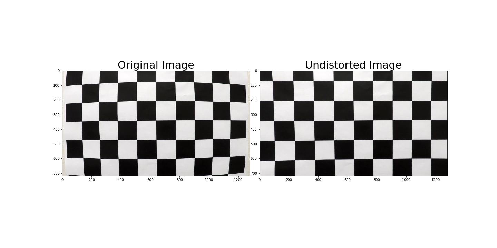
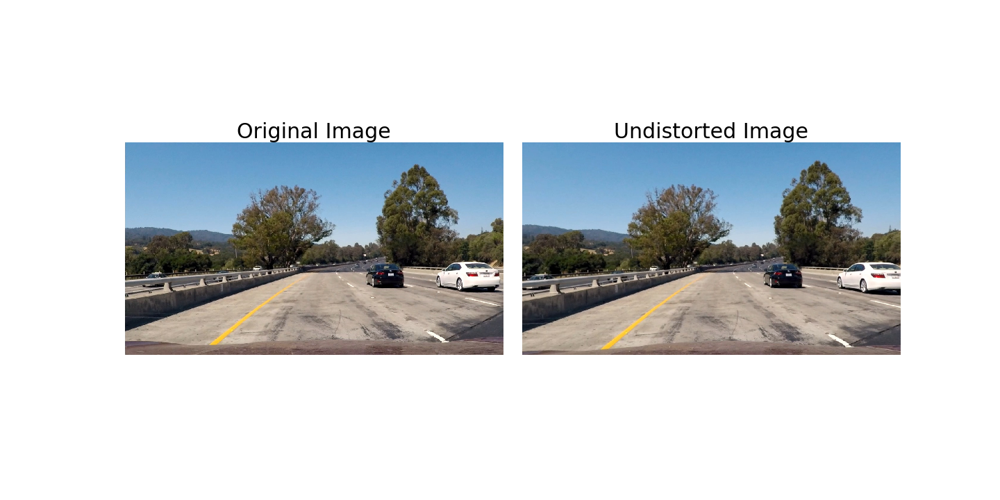
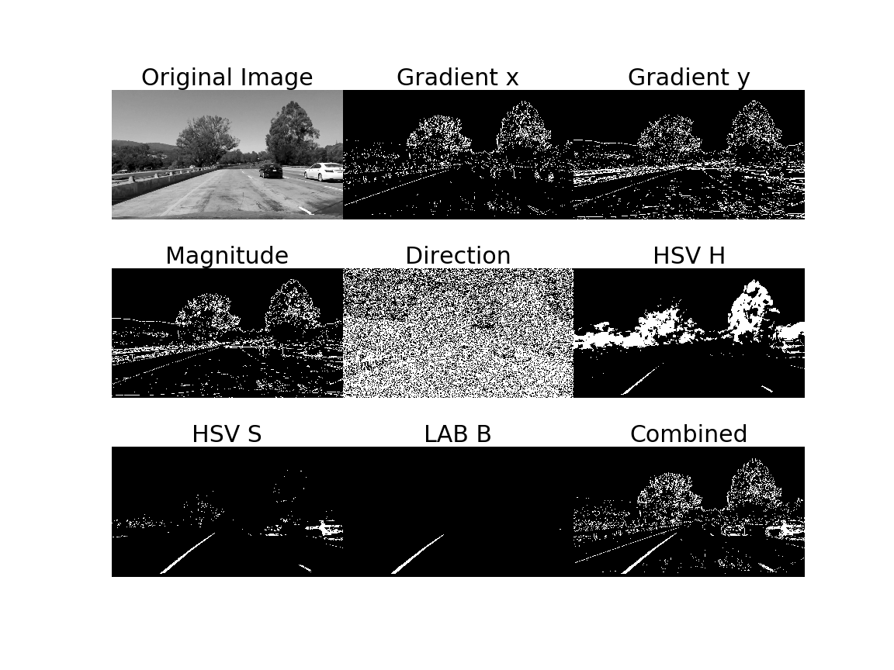
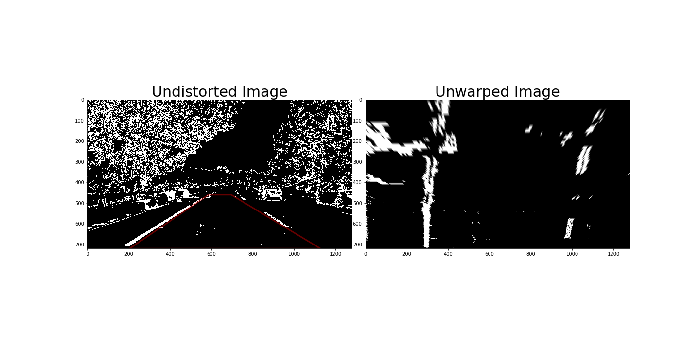
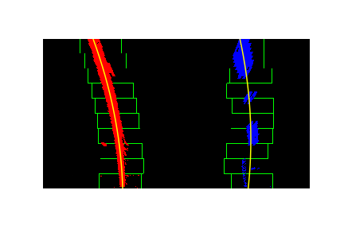

**Advanced Lane Finding Project**

The goals / steps of this project are the following:

* Compute the camera calibration matrix and distortion coefficients given a set of chessboard images.
* Apply a distortion correction to raw images.
* Use color transforms, gradients, etc., to create a thresholded binary image.
* Apply a perspective transform to rectify binary image ("birds-eye view").
* Detect lane pixels and fit to find the lane boundary.
* Determine the curvature of the lane and vehicle position with respect to center.
* Warp the detected lane boundaries back onto the original image.
* Output visual display of the lane boundaries and numerical estimation of lane curvature and vehicle position.


## [Rubric](https://review.udacity.com/#!/rubrics/571/view) Points

### Here I will consider the rubric points individually and describe how I addressed each point in my implementation.  

### Camera Calibration

#### 1. Briefly state how you computed the camera matrix and distortion coefficients. Provide an example of a distortion corrected calibration image.

I start by preparing "object points", which will be the (x, y, z) coordinates of the chessboard corners in the world. Here I am assuming the chessboard is fixed on the (x, y) plane at z=0, such that the object points are the same for each calibration image.  Thus, `objp` is just a replicated array of coordinates, and `objpoints` will be appended with a copy of it every time I successfully detect all chessboard corners in a test image.  `imgpoints` will be appended with the (x, y) pixel position of each of the corners in the image plane with each successful chessboard detection.  

I then used the output `objpoints` and `imgpoints` to compute the camera calibration and distortion coefficients using the `cv2.calibrateCamera()` function.  I applied this distortion correction to the test image using the `cv2.undistort()` function and obtained this result: 




### Pipeline (single images) function `pipeline(img)`

#### 1. Provide an example of a distortion-corrected image.

To demonstrate this step, I will describe how I apply the distortion correction to one of the test images like this one:
```python
    ret, mtx, dist, rvecs, tvecs = cv2.calibrateCamera(objpoints, imgpoints, img_size,None,None)
    dst = cv2.undistort(img, mtx, dist, None, mtx)
```
The code for my corecting distortion includes a function called `undist()`, which appears in 1st line in a function `pipeline()`.
This function's input is an image `img` and output is undistorted image `undist`, like`undist = undistort(img)`.



#### 2. Describe how (and identify where in your code) you used color transforms, gradients or other methods to create a thresholded binary image.  Provide an example of a binary image result.

I used a combination of color and gradient thresholds to generate a binary image (thresholding steps at lines 3 through 9 in function `filt_img()`).  Here's an example of my output for this step. 
And I used combined imgage of Gradinet x, HSV-S and LAB-B.

The code `filt_img()` appears in 2nd line in a function `pipeline()`.
This function's input is a distorted image `img` and gaussian blur kernel size `ksize`, and output is a binary image `img_bin`, like `img_bin = filt_im(img, ksize)`.



#### 3. Describe how (and identify where in your code) you performed a perspective transform and provide an example of a transformed image.

The code for my perspective transform includes a function called `unwarp()`, which appears in 3rd line in a function `pipeline()`. The `unwarp()` function takes as inputs an image (`img`), as well as source (`src`) and destination (`dst`) points.  I chose the hardcode the source and destination points in the following manner:

```python
src = np.float32(
    [[(img_size[0] / 2) - 55, img_size[1] / 2 + 100],
    [((img_size[0] / 6) - 10), img_size[1]],
    [(img_size[0] * 5 / 6) + 60, img_size[1]],
    [(img_size[0] / 2 + 55), img_size[1] / 2 + 100]])
dst = np.float32(
    [[(img_size[0] / 4), 0],
    [(img_size[0] / 4), img_size[1]],
    [(img_size[0] * 3 / 4), img_size[1]],
    [(img_size[0] * 3 / 4), 0]])
```

This resulted in the following source and destination points:

| Source        | Destination   | 
|:-------------:|:-------------:| 
| 585, 460      | 320, 0        | 
| 203, 720      | 320, 720      |
| 1127, 720     | 960, 720      |
| 695, 460      | 960, 0        |

I verified that my perspective transform was working as expected by drawing the `src` and `dst` points onto a test image and its warped counterpart to verify that the lines appear parallel in the warped image.

`img_unwarp, M, Minv  = unwarp(img_bin, src, dst)`: inputs are binary image, src and dst. outputs are warped image, transform matrix and inverse transform matrix.



#### 4. Describe how (and identify where in your code) you identified lane-line pixels and fit their positions with a polynomial?

I identified lane line pixcels and fit their positions with a polynomial using a function `fit_polynomial()`, which appears in 4th line in a function `pipeline()`. 

First of all, I calcurate histogram for holizontal direction in warped binary image to search starting point for the left and right lines. Then using "window search", I search points in lane area satisfying conditions (at 1st line in `fit_polynomial()` using in a function `find_lane_pixels()`. ). Finally, all the points are fitted in 2nd polynominal for lane finding (at lines 4 through 19 in function `fit_polynomial()`).

`out_img, left_fit, right_fit, left_fitx, right_fitx  = fit_polynomial(img_unwarp)`: input is a warped image, outputs are line-drawn image (shown following) and fitted lines prams.

`leftx, lefty, rightx, righty, out_img = find_lane_pixels(binary_warped)`: input is a binary image. outputs are warped image, transform matrix and inverse transform matrix.



#### 5. Describe how (and identify where in your code) you calculated the radius of curvature of the lane and the position of the vehicle with respect to center.

I did this in 24 lines in `pipeline()` in `measure_curvature_real()`

`left_curverad2, right_curverad2, center_err = measure_curvature_real(img_bin, ploty, left_fit, right_fit)`: inputs are a binary image, y points in fitted curve and left and right line. Outputs are curvature of left and right line and vehicle position from center.

#### 6. Provide an example image of your result plotted back down onto the road such that the lane area is identified clearly.

I implemented this step in lines 18 through 21 in my code in `pipeline()`.  Here is an example of my result on a test image:


---
### Pipeline (video)

#### 1. Provide a link to your final video output.  Your pipeline should perform reasonably well on the entire project video (wobbly lines are ok but no catastrophic failures that would cause the car to drive off the road!).

Here's a [link to my video result](./project_video_output.mp4)

---

### Discussion

#### 1. Briefly discuss any problems / issues you faced in your implementation of this project.  Where will your pipeline likely fail?  What could you do to make it more robust?

Here I'll talk about the approach I took, what techniques I used, what worked and why, where the pipeline might fail and how I might improve it if I were going to pursue this project further.  

* the approach I took, what techniques I used, what worked and why

I think most effective point for improving line finding is using "thresholds of HSV, LAB and x gradient" to extract binary image.
And this time, the coffients of 2nd polynominal for each frame are compared, and when a change exceeding a certain value occurs (it seems to be an outlier), the previous result is retained. I think that it makes the line-finding more robust.

* where the pipeline might fail and how I might improve it if I were going to pursue this project further.  

(1) Lost lines by brightness change: I will change thresholds adaptively.

(2) Road with small curveture: I will change ROI adaptively. For example, according to the steering (If steering is operated to left, ROI is changed to more left). And I will use high dimentional polynominal (3rd or more).

(3) Other vehicles's influences: I will detect other vihicles and ignore that.

(4) Plus I also want to consider the parallelism of the left and right fitted curves.

To achieve more robust line finding, I think I need other sensor informations.

Here's a [link to my video result of challenge video](./challenge_video_output.mp4)
Here's a [link to my video result of harder challenge video](./harder_challenge_video_output.mp4)